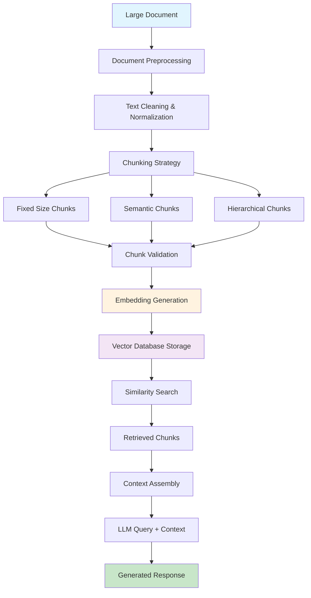

# Chunking in Generative AI - Concept Overview

## What is Chunking?

Chunking is a fundamental preprocessing technique in Generative AI and Retrieval-Augmented Generation (RAG) systems where large documents or text corpora are divided into smaller, manageable segments called "chunks." These chunks are then processed, embedded, and stored for efficient retrieval and context provision to AI models.

## Core Concepts

### Architecture Overview



### Key Components

#### 1. **Chunk Types**
Different approaches to dividing content:
- **Fixed-size chunks**: Equal character/token counts
- **Semantic chunks**: Meaningful text boundaries
- **Hierarchical chunks**: Document structure-aware
- **Overlapping chunks**: Chunks with shared boundaries

#### 2. **Chunk Boundaries**
Strategic points for splitting content:
- Sentence boundaries
- Paragraph breaks
- Section headers
- Topic transitions
- Code block boundaries

#### 3. **Metadata Preservation**
Information maintained with each chunk:
- Document source and location
- Hierarchical position
- Semantic relationships
- Creation timestamp
- Chunk quality metrics

## When to Use Chunking

### Primary Use Cases

#### 1. **Large Document Processing**
- **Best for**: Documents > 4,000 tokens (LLM context limits)
- **Examples**: Research papers, technical manuals, legal documents
- **Benefits**: Enables processing of arbitrarily large documents

#### 2. **RAG (Retrieval-Augmented Generation) Systems**
- **Best for**: Knowledge bases, documentation systems, Q&A applications
- **Examples**: Customer support, technical documentation search
- **Benefits**: Precise information retrieval, reduced hallucination

#### 3. **Semantic Search Applications**
- **Best for**: Content discovery, similar document finding
- **Examples**: Academic research, content recommendation
- **Benefits**: Fine-grained similarity matching

#### 4. **Memory-Constrained Environments**
- **Best for**: Applications with limited computational resources
- **Examples**: Edge deployments, mobile applications
- **Benefits**: Reduced memory usage, faster processing

#### 5. **Multi-Modal Content**
- **Best for**: Documents with mixed content types
- **Examples**: Technical documentation with images, code repositories
- **Benefits**: Specialized processing for different content types

### Specific Scenarios

#### Knowledge Management Systems
```python
# Example: Corporate knowledge base
document_types = [
    "policy_documents",      # Chunking by sections
    "technical_manuals",     # Chunking by procedures
    "meeting_transcripts",   # Chunking by topics
    "code_documentation"     # Chunking by functions/classes
]
```

#### Customer Support Systems
```python
# Example: Support documentation
chunk_strategies = {
    "faq": "question_answer_pairs",
    "troubleshooting": "step_by_step_procedures", 
    "product_manuals": "feature_based_sections",
    "api_docs": "endpoint_descriptions"
}
```

## When NOT to Use Chunking

### Avoid Chunking When:

#### 1. **Short Documents (< 1,000 tokens)**
- **Why**: Overhead outweighs benefits
- **Alternative**: Process documents whole
- **Example**: Short articles, emails, social media posts

#### 2. **Highly Interconnected Content**
- **Why**: Context loss breaks understanding
- **Alternative**: Use longer chunks or whole document processing
- **Example**: Mathematical proofs, legal contracts, narrative stories

#### 3. **Real-Time Streaming Content**
- **Why**: Chunking introduces latency
- **Alternative**: Stream processing, sliding windows
- **Example**: Live chat, real-time monitoring data

#### 4. **Structured Data**
- **Why**: Breaking structure destroys meaning
- **Alternative**: Schema-aware processing
- **Example**: JSON documents, CSV files, database records

#### 5. **Code with Complex Dependencies**
- **Why**: Function/class relationships are broken
- **Alternative**: AST-based chunking, dependency-aware splitting
- **Example**: Large codebases with intricate imports

### Problematic Scenarios

#### Poetry and Creative Writing
```python
# ❌ Bad: Chunking destroys artistic flow
poem_chunks = split_by_sentences(poem)  # Loses rhythm and meaning

# ✅ Good: Preserve artistic integrity
poem_analysis = analyze_whole_poem(poem)  # Maintains flow and context
```

#### Mathematical Content
```python
# ❌ Bad: Breaking mathematical proofs
proof_chunks = split_by_paragraphs(mathematical_proof)  # Loses logical flow

# ✅ Good: Preserve logical structure
proof_sections = split_by_logical_steps(mathematical_proof)  # Maintains reasoning
```

## Best Practices

### 1. Chunk Size Optimization

#### Choose Appropriate Chunk Sizes
```python
# Recommended chunk sizes by use case
CHUNK_SIZES = {
    "qa_systems": {"min": 200, "max": 800, "optimal": 512},
    "semantic_search": {"min": 100, "max": 500, "optimal": 256},
    "summarization": {"min": 500, "max": 2000, "optimal": 1024},
    "code_analysis": {"min": 50, "max": 1000, "optimal": 400}
}

def get_optimal_chunk_size(use_case: str, content_type: str) -> int:
    """Get optimal chunk size for specific use case."""
    base_size = CHUNK_SIZES.get(use_case, {"optimal": 512})["optimal"]
    
    # Adjust based on content type
    if content_type == "technical":
        return int(base_size * 1.2)  # Technical content needs more context
    elif content_type == "conversational":
        return int(base_size * 0.8)  # Conversational content can be shorter
    
    return base_size
```

#### Dynamic Chunk Sizing
```python
import tiktoken

def dynamic_chunk_size(text: str, model: str = "gpt-3.5-turbo") -> int:
    """Calculate optimal chunk size based on content complexity."""
    encoding = tiktoken.encoding_for_model(model)
    tokens = encoding.encode(text)
    
    # Analyze text complexity
    sentences = text.split('.')
    avg_sentence_length = len(tokens) / len(sentences) if sentences else 50
    
    # Adjust chunk size based on complexity
    if avg_sentence_length > 30:  # Complex sentences
        return 400  # Smaller chunks for complex content
    elif avg_sentence_length < 15:  # Simple sentences
        return 800  # Larger chunks for simple content
    else:
        return 600  # Standard chunk size
```

### 2. Semantic Boundary Preservation

#### Intelligent Boundary Detection
```python
import spacy
from typing import List, Tuple

nlp = spacy.load("en_core_web_sm")

def find_semantic_boundaries(text: str, max_chunk_size: int = 512) -> List[Tuple[int, int]]:
    """Find semantic boundaries for intelligent chunking."""
    doc = nlp(text)
    boundaries = []
    current_start = 0
    current_length = 0
    
    for sent in doc.sents:
        sent_length = len(sent.text)
        
        # Check if adding this sentence exceeds chunk size
        if current_length + sent_length > max_chunk_size and current_length > 0:
            boundaries.append((current_start, current_start + current_length))
            current_start = sent.start_char
            current_length = sent_length
        else:
            current_length += sent_length
    
    # Add final chunk
    if current_length > 0:
        boundaries.append((current_start, current_start + current_length))
    
    return boundaries
```

#### Topic-Based Chunking
```python
from sklearn.feature_extraction.text import TfidfVectorizer
from sklearn.cluster import KMeans
import numpy as np

def topic_based_chunking(text: str, num_topics: int = 5) -> List[str]:
    """Chunk text based on topic coherence."""
    sentences = text.split('.')
    
    # Vectorize sentences
    vectorizer = TfidfVectorizer(max_features=1000, stop_words='english')
    X = vectorizer.fit_transform(sentences)
    
    # Cluster sentences by topic
    kmeans = KMeans(n_clusters=num_topics, random_state=42)
    clusters = kmeans.fit_predict(X)
    
    # Group sentences by cluster
    topic_chunks = {}
    for i, cluster in enumerate(clusters):
        if cluster not in topic_chunks:
            topic_chunks[cluster] = []
        topic_chunks[cluster].append(sentences[i])
    
    # Convert to chunk list
    chunks = ['. '.join(sentences) for sentences in topic_chunks.values()]
    return chunks
```

### 3. Overlap Strategies

#### Strategic Overlap Implementation
```python
def create_overlapping_chunks(
    text: str, 
    chunk_size: int = 512, 
    overlap_size: int = 50
) -> List[dict]:
    """Create chunks with strategic overlap for context preservation."""
    chunks = []
    start = 0
    
    while start < len(text):
        # Calculate end position
        end = min(start + chunk_size, len(text))
        
        # Adjust to sentence boundary if possible
        if end < len(text):
            # Look for sentence boundary within last 100 characters
            boundary_search = text[max(end - 100, start):end + 50]
            sentence_end = boundary_search.rfind('.')
            if sentence_end != -1:
                end = max(end - 100, start) + sentence_end + 1
        
        chunk_text = text[start:end].strip()
        
        if chunk_text:
            chunks.append({
                "text": chunk_text,
                "start_char": start,
                "end_char": end,
                "chunk_id": len(chunks),
                "overlap_with_previous": start > 0 and start < overlap_size,
                "tokens": len(chunk_text.split())
            })
        
        # Calculate next start position with overlap
        if end >= len(text):
            break
        start = max(start + chunk_size - overlap_size, start + 1)
    
    return chunks
```

### 4. Metadata Management

#### Comprehensive Chunk Metadata
```python
from datetime import datetime
import hashlib
from typing import Dict, Any

class ChunkMetadata:
    """Comprehensive metadata for document chunks."""
    
    def __init__(self, text: str, source_doc: str, chunk_id: int):
        self.text = text
        self.source_document = source_doc
        self.chunk_id = chunk_id
        self.created_at = datetime.utcnow()
        self.hash = self._calculate_hash()
        self.stats = self._calculate_stats()
    
    def _calculate_hash(self) -> str:
        """Calculate content hash for deduplication."""
        return hashlib.md5(self.text.encode()).hexdigest()
    
    def _calculate_stats(self) -> Dict[str, Any]:
        """Calculate chunk statistics."""
        words = self.text.split()
        sentences = self.text.split('.')
        
        return {
            "word_count": len(words),
            "sentence_count": len(sentences),
            "character_count": len(self.text),
            "avg_word_length": sum(len(word) for word in words) / len(words) if words else 0,
            "avg_sentence_length": len(words) / len(sentences) if sentences else 0
        }
    
    def to_dict(self) -> Dict[str, Any]:
        """Convert metadata to dictionary."""
        return {
            "chunk_id": self.chunk_id,
            "source_document": self.source_document,
            "created_at": self.created_at.isoformat(),
            "content_hash": self.hash,
            "statistics": self.stats,
            "text_preview": self.text[:100] + "..." if len(self.text) > 100 else self.text
        }
```

### 5. Quality Validation

#### Chunk Quality Assessment
```python
import re
from typing import List, Dict

def assess_chunk_quality(chunk: str) -> Dict[str, Any]:
    """Assess the quality of a text chunk."""
    quality_metrics = {
        "completeness": 0.0,
        "coherence": 0.0,
        "informativeness": 0.0,
        "issues": []
    }
    
    # Check completeness (sentences should be complete)
    if chunk.strip().endswith(('.', '!', '?', ':')):
        quality_metrics["completeness"] += 0.5
    if chunk.strip()[0].isupper():
        quality_metrics["completeness"] += 0.5
    
    # Check coherence (should have logical flow)
    sentences = chunk.split('.')
    if len(sentences) >= 2:
        # Simple coherence check - look for connecting words
        connecting_words = ['however', 'therefore', 'moreover', 'furthermore', 'additionally']
        has_connections = any(word in chunk.lower() for word in connecting_words)
        quality_metrics["coherence"] = 0.7 if has_connections else 0.3
    else:
        quality_metrics["coherence"] = 0.5  # Single sentence chunks
    
    # Check informativeness (keyword density, proper nouns)
    words = chunk.split()
    proper_nouns = sum(1 for word in words if word[0].isupper() and word.lower() not in ['the', 'a', 'an'])
    keyword_density = proper_nouns / len(words) if words else 0
    quality_metrics["informativeness"] = min(keyword_density * 2, 1.0)
    
    # Identify issues
    if len(chunk.strip()) < 50:
        quality_metrics["issues"].append("too_short")
    if len(chunk.strip()) > 2000:
        quality_metrics["issues"].append("too_long")
    if not re.search(r'[.!?]', chunk):
        quality_metrics["issues"].append("no_sentence_ending")
    if chunk.count(' ') < 5:
        quality_metrics["issues"].append("insufficient_words")
    
    return quality_metrics

def filter_quality_chunks(chunks: List[str], min_quality: float = 0.6) -> List[str]:
    """Filter chunks based on quality metrics."""
    quality_chunks = []
    
    for chunk in chunks:
        quality = assess_chunk_quality(chunk)
        avg_quality = sum(quality[metric] for metric in ["completeness", "coherence", "informativeness"]) / 3
        
        if avg_quality >= min_quality and len(quality["issues"]) <= 1:
            quality_chunks.append(chunk)
    
    return quality_chunks
```

## OpenAI Implementation Examples

### 1. Basic RAG System with Chunking

```python
import openai
from typing import List, Dict
import numpy as np
from sklearn.metrics.pairwise import cosine_similarity

class OpenAIRAGSystem:
    """RAG system using OpenAI embeddings and GPT for generation."""
    
    def __init__(self, api_key: str):
        self.client = openai.OpenAI(api_key=api_key)
        self.chunk_embeddings = {}
        self.chunks = {}
    
    def create_embeddings(self, chunks: List[str], chunk_ids: List[str]) -> None:
        """Create embeddings for text chunks using OpenAI."""
        for chunk, chunk_id in zip(chunks, chunk_ids):
            response = self.client.embeddings.create(
                model="text-embedding-3-small",
                input=chunk
            )
            self.chunk_embeddings[chunk_id] = response.data[0].embedding
            self.chunks[chunk_id] = chunk
    
    def retrieve_relevant_chunks(self, query: str, top_k: int = 3) -> List[str]:
        """Retrieve most relevant chunks for a query."""
        # Get query embedding
        query_response = self.client.embeddings.create(
            model="text-embedding-3-small",
            input=query
        )
        query_embedding = query_response.data[0].embedding
        
        # Calculate similarities
        similarities = {}
        for chunk_id, chunk_embedding in self.chunk_embeddings.items():
            similarity = cosine_similarity(
                [query_embedding], 
                [chunk_embedding]
            )[0][0]
            similarities[chunk_id] = similarity
        
        # Get top-k chunks
        top_chunks = sorted(similarities.items(), key=lambda x: x[1], reverse=True)[:top_k]
        return [self.chunks[chunk_id] for chunk_id, _ in top_chunks]
    
    def generate_response(self, query: str, context_chunks: List[str]) -> str:
        """Generate response using retrieved chunks as context."""
        context = "\n\n".join(context_chunks)
        
        messages = [
            {"role": "system", "content": "You are a helpful assistant. Use the provided context to answer questions accurately. If the context doesn't contain relevant information, say so."},
            {"role": "user", "content": f"Context:\n{context}\n\nQuestion: {query}"}
        ]
        
        response = self.client.chat.completions.create(
            model="gpt-4",
            messages=messages,
            max_tokens=500,
            temperature=0.1
        )
        
        return response.choices[0].message.content
    
    def query(self, question: str, top_k: int = 3) -> Dict[str, any]:
        """End-to-end query processing."""
        # Retrieve relevant chunks
        relevant_chunks = self.retrieve_relevant_chunks(question, top_k)
        
        # Generate response
        response = self.generate_response(question, relevant_chunks)
        
        return {
            "question": question,
            "retrieved_chunks": relevant_chunks,
            "response": response,
            "num_chunks_used": len(relevant_chunks)
        }

# Usage Example
rag_system = OpenAIRAGSystem(api_key="your-openai-api-key")

# Prepare documents and create chunks
documents = [
    "Artificial intelligence (AI) is intelligence demonstrated by machines...",
    "Machine learning is a method of data analysis that automates analytical model building...",
    "Natural language processing (NLP) is a subfield of linguistics, computer science..."
]

chunks = []
chunk_ids = []
for i, doc in enumerate(documents):
    doc_chunks = create_overlapping_chunks(doc, chunk_size=256, overlap_size=50)
    for j, chunk_data in enumerate(doc_chunks):
        chunks.append(chunk_data["text"])
        chunk_ids.append(f"doc_{i}_chunk_{j}")

# Create embeddings
rag_system.create_embeddings(chunks, chunk_ids)

# Query the system
result = rag_system.query("What is machine learning?")
print(f"Response: {result['response']}")
```

### 2. Advanced Chunk Processing with OpenAI

```python
import openai
import json
from typing import List, Dict, Optional
import asyncio
import aiohttp

class AdvancedChunkProcessor:
    """Advanced chunk processing with OpenAI for multiple tasks."""
    
    def __init__(self, api_key: str):
        self.client = openai.OpenAI(api_key=api_key)
    
    async def process_chunk_batch(self, chunks: List[str], task: str) -> List[Dict]:
        """Process multiple chunks concurrently."""
        tasks = [self.process_single_chunk(chunk, task) for chunk in chunks]
        results = await asyncio.gather(*tasks, return_exceptions=True)
        
        return [
            result if not isinstance(result, Exception) else {"error": str(result)}
            for result in results
        ]
    
    async def process_single_chunk(self, chunk: str, task: str) -> Dict:
        """Process a single chunk for specific task."""
        prompts = {
            "summarize": "Provide a concise summary of this text:",
            "extract_entities": "Extract named entities (people, places, organizations) from this text:",
            "classify_topic": "Classify the main topic of this text:",
            "generate_questions": "Generate 3 relevant questions that could be answered by this text:",
            "analyze_sentiment": "Analyze the sentiment (positive, negative, neutral) of this text:"
        }
        
        if task not in prompts:
            raise ValueError(f"Unknown task: {task}")
        
        prompt = f"{prompts[task]}\n\nText: {chunk}"
        
        response = self.client.chat.completions.create(
            model="gpt-3.5-turbo",
            messages=[{"role": "user", "content": prompt}],
            max_tokens=200,
            temperature=0.1
        )
        
        return {
            "chunk": chunk[:100] + "...",
            "task": task,
            "result": response.choices[0].message.content,
            "tokens_used": response.usage.total_tokens
        }
    
    def intelligent_chunk_merging(self, chunks: List[str], max_tokens: int = 3000) -> List[str]:
        """Intelligently merge related chunks using OpenAI."""
        if len(chunks) <= 1:
            return chunks
        
        # Analyze semantic similarity between adjacent chunks
        merged_chunks = []
        current_group = [chunks[0]]
        current_tokens = len(chunks[0].split())
        
        for i in range(1, len(chunks)):
            chunk = chunks[i]
            chunk_tokens = len(chunk.split())
            
            # Check if chunks are semantically related
            similarity_prompt = f"""
            Are these two text segments discussing related topics? Answer with just "YES" or "NO".
            
            Segment 1: {current_group[-1][:200]}...
            Segment 2: {chunk[:200]}...
            """
            
            try:
                response = self.client.chat.completions.create(
                    model="gpt-3.5-turbo",
                    messages=[{"role": "user", "content": similarity_prompt}],
                    max_tokens=10,
                    temperature=0
                )
                
                is_related = response.choices[0].message.content.strip().upper() == "YES"
                
                # Merge if related and within token limit
                if is_related and current_tokens + chunk_tokens <= max_tokens:
                    current_group.append(chunk)
                    current_tokens += chunk_tokens
                else:
                    # Finalize current group and start new one
                    merged_chunks.append(" ".join(current_group))
                    current_group = [chunk]
                    current_tokens = chunk_tokens
                    
            except Exception as e:
                print(f"Error in similarity check: {e}")
                # Default behavior: merge if within token limit
                if current_tokens + chunk_tokens <= max_tokens:
                    current_group.append(chunk)
                    current_tokens += chunk_tokens
                else:
                    merged_chunks.append(" ".join(current_group))
                    current_group = [chunk]
                    current_tokens = chunk_tokens
        
        # Add final group
        if current_group:
            merged_chunks.append(" ".join(current_group))
        
        return merged_chunks
    
    def adaptive_chunking(self, text: str, purpose: str) -> List[str]:
        """Create purpose-specific chunks using OpenAI analysis."""
        purpose_strategies = {
            "qa": {"size": 400, "overlap": 50, "boundary": "sentence"},
            "summarization": {"size": 800, "overlap": 100, "boundary": "paragraph"},
            "search": {"size": 300, "overlap": 30, "boundary": "sentence"},
            "analysis": {"size": 600, "overlap": 80, "boundary": "paragraph"}
        }
        
        strategy = purpose_strategies.get(purpose, purpose_strategies["qa"])
        
        # First, create initial chunks
        initial_chunks = create_overlapping_chunks(
            text, 
            chunk_size=strategy["size"], 
            overlap_size=strategy["overlap"]
        )
        
        # Optimize chunks using OpenAI
        optimized_chunks = []
        for chunk_data in initial_chunks:
            chunk_text = chunk_data["text"]
            
            # Ask OpenAI to optimize the chunk boundaries
            optimization_prompt = f"""
            Optimize this text chunk for {purpose}. 
            Ensure it ends at a natural boundary and contains complete thoughts.
            Return only the optimized text without explanation.
            
            Original chunk: {chunk_text}
            """
            
            try:
                response = self.client.chat.completions.create(
                    model="gpt-3.5-turbo",
                    messages=[{"role": "user", "content": optimization_prompt}],
                    max_tokens=strategy["size"] + 100,
                    temperature=0.1
                )
                
                optimized_text = response.choices[0].message.content.strip()
                optimized_chunks.append(optimized_text)
                
            except Exception as e:
                print(f"Error optimizing chunk: {e}")
                optimized_chunks.append(chunk_text)  # Fall back to original
        
        return optimized_chunks

# Usage Example
processor = AdvancedChunkProcessor(api_key="your-openai-api-key")

# Example document
document = """
Machine learning is a subset of artificial intelligence that focuses on the development of algorithms 
and statistical models that enable computer systems to improve their performance on a specific task 
through experience. Unlike traditional programming where rules are explicitly coded, machine learning 
systems learn patterns from data to make predictions or decisions.

There are three main types of machine learning: supervised learning, unsupervised learning, and 
reinforcement learning. Supervised learning uses labeled training data to learn a mapping function 
from inputs to outputs. Unsupervised learning finds hidden patterns in data without labeled examples. 
Reinforcement learning involves an agent learning through interaction with an environment.
"""

# Create adaptive chunks for Q&A
qa_chunks = processor.adaptive_chunking(document, "qa")
print(f"Created {len(qa_chunks)} chunks for Q&A")

# Process chunks for multiple tasks
async def process_example():
    tasks = ["summarize", "extract_entities", "generate_questions"]
    
    for task in tasks:
        results = await processor.process_chunk_batch(qa_chunks, task)
        print(f"\n{task.upper()} Results:")
        for result in results:
            if "error" not in result:
                print(f"- {result['result']}")

# Run the example
# asyncio.run(process_example())
```

### 3. Production-Ready Chunking Pipeline

```python
import openai
import logging
from dataclasses import dataclass
from typing import List, Dict, Optional, Any
import hashlib
import json
import time
from concurrent.futures import ThreadPoolExecutor
import pickle

@dataclass
class ChunkConfig:
    """Configuration for chunking pipeline."""
    chunk_size: int = 512
    overlap_size: int = 50
    min_chunk_size: int = 100
    max_chunk_size: int = 2000
    quality_threshold: float = 0.6
    embedding_model: str = "text-embedding-3-small"
    cache_embeddings: bool = True
    max_retries: int = 3
    retry_delay: float = 1.0

class ProductionChunkingPipeline:
    """Production-ready chunking pipeline with OpenAI integration."""
    
    def __init__(self, config: ChunkConfig, api_key: str):
        self.config = config
        self.client = openai.OpenAI(api_key=api_key)
        self.logger = self._setup_logging()
        self.embedding_cache = {}
        self.stats = {
            "chunks_processed": 0,
            "embeddings_created": 0,
            "cache_hits": 0,
            "api_calls": 0,
            "errors": 0
        }
    
    def _setup_logging(self) -> logging.Logger:
        """Setup logging for the pipeline."""
        logger = logging.getLogger("chunking_pipeline")
        logger.setLevel(logging.INFO)
        
        if not logger.handlers:
            handler = logging.StreamHandler()
            formatter = logging.Formatter(
                '%(asctime)s - %(name)s - %(levelname)s - %(message)s'
            )
            handler.setFormatter(formatter)
            logger.addHandler(handler)
        
        return logger
    
    def process_document(self, text: str, document_id: str) -> Dict[str, Any]:
        """Process a complete document through the chunking pipeline."""
        start_time = time.time()
        
        try:
            self.logger.info(f"Processing document {document_id}")
            
            # Step 1: Create chunks
            chunks = self._create_chunks(text)
            self.logger.info(f"Created {len(chunks)} initial chunks")
            
            # Step 2: Quality filtering
            quality_chunks = self._filter_quality_chunks(chunks)
            self.logger.info(f"Filtered to {len(quality_chunks)} quality chunks")
            
            # Step 3: Create embeddings
            chunk_embeddings = self._create_embeddings_batch(quality_chunks)
            self.logger.info(f"Created embeddings for {len(chunk_embeddings)} chunks")
            
            # Step 4: Package results
            processed_chunks = []
            for i, (chunk, embedding) in enumerate(zip(quality_chunks, chunk_embeddings)):
                processed_chunks.append({
                    "chunk_id": f"{document_id}_chunk_{i}",
                    "text": chunk["text"],
                    "embedding": embedding,
                    "metadata": {
                        "document_id": document_id,
                        "chunk_index": i,
                        "start_char": chunk["start_char"],
                        "end_char": chunk["end_char"],
                        "token_count": chunk["tokens"],
                        "quality_score": chunk.get("quality_score", 0.0)
                    },
                    "created_at": time.time()
                })
            
            processing_time = time.time() - start_time
            
            result = {
                "document_id": document_id,
                "chunks": processed_chunks,
                "stats": {
                    "total_chunks": len(processed_chunks),
                    "processing_time": processing_time,
                    "original_length": len(text),
                    "chunks_per_second": len(processed_chunks) / processing_time if processing_time > 0 else 0
                }
            }
            
            self.stats["chunks_processed"] += len(processed_chunks)
            self.logger.info(f"Document {document_id} processed in {processing_time:.2f}s")
            
            return result
            
        except Exception as e:
            self.stats["errors"] += 1
            self.logger.error(f"Error processing document {document_id}: {e}")
            raise
    
    def _create_chunks(self, text: str) -> List[Dict[str, Any]]:
        """Create chunks with advanced boundary detection."""
        chunks = create_overlapping_chunks(
            text, 
            chunk_size=self.config.chunk_size,
            overlap_size=self.config.overlap_size
        )
        
        # Add quality assessment
        for chunk in chunks:
            chunk["quality_score"] = self._assess_chunk_quality(chunk["text"])
        
        return chunks
    
    def _filter_quality_chunks(self, chunks: List[Dict[str, Any]]) -> List[Dict[str, Any]]:
        """Filter chunks based on quality metrics."""
        filtered_chunks = []
        
        for chunk in chunks:
            # Size filtering
            if (chunk["tokens"] < self.config.min_chunk_size or 
                chunk["tokens"] > self.config.max_chunk_size):
                continue
            
            # Quality filtering
            if chunk["quality_score"] < self.config.quality_threshold:
                continue
            
            filtered_chunks.append(chunk)
        
        return filtered_chunks
    
    def _assess_chunk_quality(self, text: str) -> float:
        """Assess chunk quality with multiple metrics."""
        quality_metrics = assess_chunk_quality(text)
        return sum(quality_metrics[metric] for metric in ["completeness", "coherence", "informativeness"]) / 3
    
    def _create_embeddings_batch(self, chunks: List[Dict[str, Any]]) -> List[List[float]]:
        """Create embeddings for chunks with caching and retry logic."""
        embeddings = []
        
        for chunk in chunks:
            text = chunk["text"]
            cache_key = hashlib.md5(text.encode()).hexdigest()
            
            # Check cache first
            if self.config.cache_embeddings and cache_key in self.embedding_cache:
                embeddings.append(self.embedding_cache[cache_key])
                self.stats["cache_hits"] += 1
                continue
            
            # Create embedding with retry logic
            embedding = self._create_embedding_with_retry(text)
            embeddings.append(embedding)
            
            # Cache embedding
            if self.config.cache_embeddings:
                self.embedding_cache[cache_key] = embedding
            
            self.stats["embeddings_created"] += 1
        
        return embeddings
    
    def _create_embedding_with_retry(self, text: str) -> List[float]:
        """Create embedding with retry logic for robustness."""
        for attempt in range(self.config.max_retries):
            try:
                self.stats["api_calls"] += 1
                response = self.client.embeddings.create(
                    model=self.config.embedding_model,
                    input=text
                )
                return response.data[0].embedding
                
            except Exception as e:
                self.logger.warning(f"Embedding attempt {attempt + 1} failed: {e}")
                if attempt < self.config.max_retries - 1:
                    time.sleep(self.config.retry_delay * (2 ** attempt))  # Exponential backoff
                else:
                    self.logger.error(f"Failed to create embedding after {self.config.max_retries} attempts")
                    raise
    
    def save_cache(self, filepath: str) -> None:
        """Save embedding cache to disk."""
        with open(filepath, 'wb') as f:
            pickle.dump(self.embedding_cache, f)
        self.logger.info(f"Saved {len(self.embedding_cache)} cached embeddings to {filepath}")
    
    def load_cache(self, filepath: str) -> None:
        """Load embedding cache from disk."""
        try:
            with open(filepath, 'rb') as f:
                self.embedding_cache = pickle.load(f)
            self.logger.info(f"Loaded {len(self.embedding_cache)} cached embeddings from {filepath}")
        except FileNotFoundError:
            self.logger.info("No cache file found, starting with empty cache")
        except Exception as e:
            self.logger.error(f"Error loading cache: {e}")
    
    def get_stats(self) -> Dict[str, Any]:
        """Get pipeline statistics."""
        return self.stats.copy()

# Usage Example
config = ChunkConfig(
    chunk_size=400,
    overlap_size=40,
    quality_threshold=0.7,
    cache_embeddings=True
)

pipeline = ProductionChunkingPipeline(config, api_key="your-openai-api-key")

# Load existing cache if available
pipeline.load_cache("embeddings_cache.pkl")

# Process documents
documents = {
    "doc1": "Your first document text here...",
    "doc2": "Your second document text here...",
}

results = {}
for doc_id, text in documents.items():
    results[doc_id] = pipeline.process_document(text, doc_id)

# Save cache for future use
pipeline.save_cache("embeddings_cache.pkl")

# Print statistics
print("Pipeline Statistics:")
print(json.dumps(pipeline.get_stats(), indent=2))
```

## Advanced Chunking Patterns

### Hierarchical Chunking
```python
class HierarchicalChunker:
    """Create hierarchical chunks that preserve document structure."""
    
    def __init__(self, chunk_sizes: List[int] = [100, 400, 1000]):
        self.chunk_sizes = sorted(chunk_sizes)
    
    def create_hierarchy(self, text: str) -> Dict[str, List[str]]:
        """Create multiple levels of chunks."""
        hierarchy = {}
        
        for size in self.chunk_sizes:
            level_name = f"level_{size}"
            chunks = create_overlapping_chunks(text, chunk_size=size, overlap_size=size//10)
            hierarchy[level_name] = [chunk["text"] for chunk in chunks]
        
        return hierarchy
```

### Adaptive Chunk Sizing
```python
def adaptive_chunk_size(text: str, complexity_threshold: float = 0.7) -> int:
    """Determine optimal chunk size based on text complexity."""
    # Analyze text complexity using various metrics
    sentences = text.split('.')
    avg_sentence_length = sum(len(s.split()) for s in sentences) / len(sentences)
    
    # Technical term density
    technical_terms = ['algorithm', 'implementation', 'framework', 'architecture']
    technical_density = sum(text.lower().count(term) for term in technical_terms) / len(text.split())
    
    # Complexity score
    complexity = (avg_sentence_length / 20) + (technical_density * 10)
    
    if complexity > complexity_threshold:
        return 300  # Smaller chunks for complex content
    else:
        return 600  # Larger chunks for simpler content
```

## Monitoring and Optimization

### Chunk Performance Metrics
```python
class ChunkingMetrics:
    """Track and analyze chunking performance."""
    
    def __init__(self):
        self.metrics = {
            "retrieval_accuracy": [],
            "response_quality": [],
            "processing_time": [],
            "chunk_utilization": []
        }
    
    def track_retrieval(self, query: str, retrieved_chunks: List[str], relevance_scores: List[float]):
        """Track retrieval performance."""
        avg_relevance = sum(relevance_scores) / len(relevance_scores) if relevance_scores else 0
        self.metrics["retrieval_accuracy"].append(avg_relevance)
    
    def analyze_optimal_chunk_size(self) -> Dict[str, float]:
        """Analyze optimal chunk size based on performance."""
        return {
            "avg_retrieval_accuracy": sum(self.metrics["retrieval_accuracy"]) / len(self.metrics["retrieval_accuracy"]),
            "avg_processing_time": sum(self.metrics["processing_time"]) / len(self.metrics["processing_time"]),
            "recommendation": "Consider smaller chunks" if sum(self.metrics["retrieval_accuracy"]) / len(self.metrics["retrieval_accuracy"]) < 0.7 else "Current chunk size is optimal"
        }
```

## Conclusion

Chunking is a foundational technique in modern AI applications that enables efficient processing of large documents and precise information retrieval. Success depends on choosing appropriate strategies based on your specific use case, content type, and performance requirements.

Key takeaways:
- **Strategic Implementation**: Choose chunking strategies based on content type and use case
- **Quality over Quantity**: Focus on meaningful chunk boundaries rather than arbitrary splits
- **Context Preservation**: Use overlap and semantic awareness to maintain information coherence
- **Performance Monitoring**: Continuously evaluate and optimize chunking strategies
- **Tool Integration**: Leverage AI models like OpenAI's GPT and embedding models for intelligent chunking

The examples provided demonstrate production-ready patterns that can be adapted for specific requirements while maintaining best practices for performance, quality, and scalability.

## Next Steps

- [RAG Implementation Patterns](./rag-patterns.md) - Complete RAG system patterns
- [Vector Database Integration](./vector-databases.md) - Storage and retrieval optimization
- [LLM Integration Best Practices](./llm-integration.md) - Advanced AI model integration
- [Performance Optimization](./performance-optimization.md) - Scaling chunking systems

## External Resources

- [OpenAI Embeddings Documentation](https://platform.openai.com/docs/guides/embeddings)
- [LangChain Text Splitters](https://python.langchain.com/docs/modules/data_connection/document_transformers/)
- [Semantic Chunking Research](https://arxiv.org/abs/2109.07445)
- [RAG Best Practices](https://huggingface.co/blog/rag)